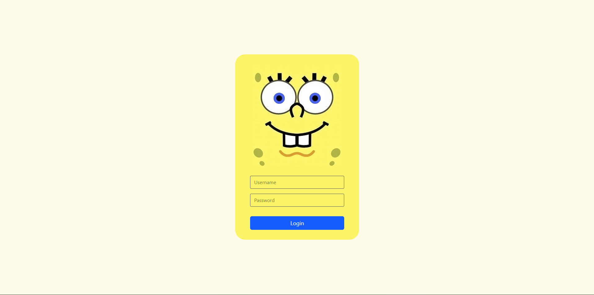
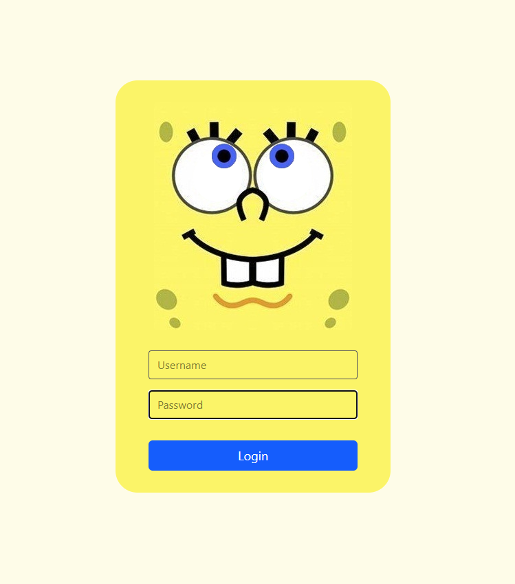
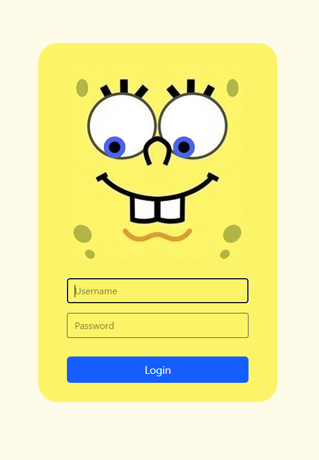
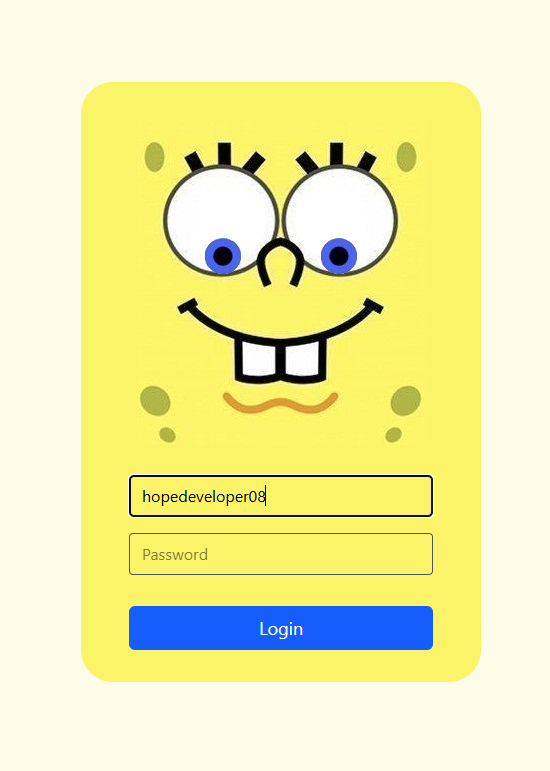
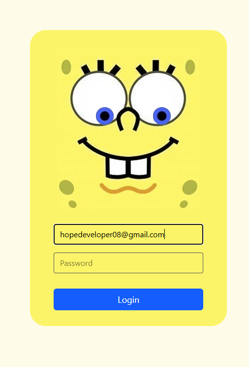
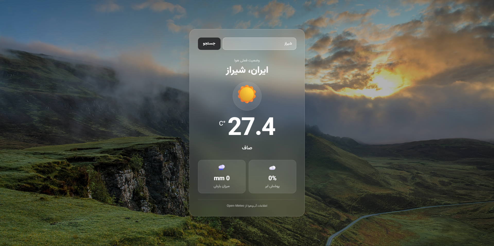
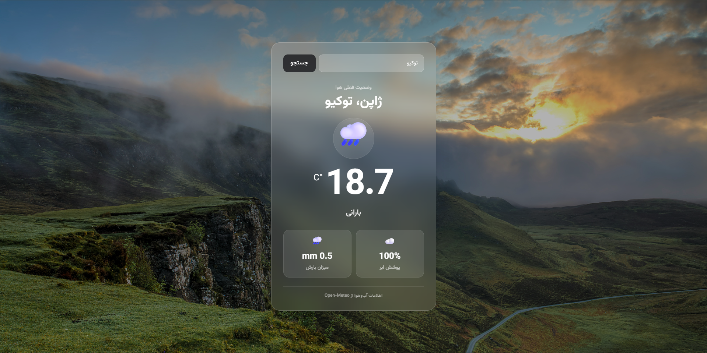
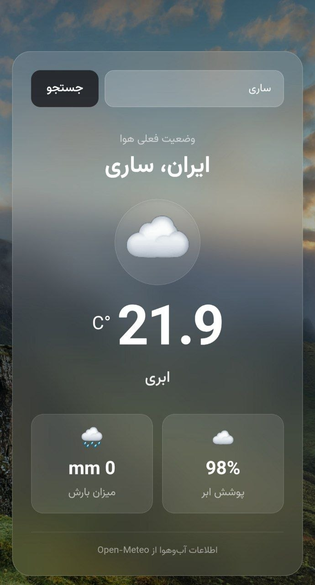

# مینی‌پروژه‌های فرانت‌اند

این مجموعه شامل تعدادی مینی‌پروژه و اپلیکیشن فرانت‌اند است که به‌صورت مستقل و در قالب یک پروژه‌ی یکپارچه با **React.js** توسعه داده شده‌اند.

هدف از ایجاد این مجموعه، پیاده‌سازی عملی مفاهیم و تکنیک‌های توسعه‌ی رابط کاربری، تمرین معماری و ساختاردهی پروژه‌های React و ارائه‌ی نمونه‌هایی از توانایی‌های من در توسعه‌ی **Front-End** است.

در این پروژه‌ها تلاش شده است رابط‌های کاربری با تمرکز بر **سادگی، خوانایی کد، ساختار مناسب و تجربه کاربری مطلوب** پیاده‌سازی شوند.

### تکنولوژی‌ها و ابزارهای مورد استفاده

* **HTML, CSS**
* **Tailwind CSS**
* **TypeScript**
* **React.js**

هر یک از مینی‌پروژه‌ها با هدف پیاده‌سازی یک قابلیت، سناریو یا رابط کاربری مشخص توسعه داده شده و در مجموع، مجموعه‌ای از نمونه‌کارهای عملی در حوزه‌ی توسعه‌ی فرانت‌اند را تشکیل می‌دهند.

# لیست پروژه ها
[فرم لاگین باب اسفنجی](#فرم-لاگین-باب-اسفنجی)
[اپلیکیشن آب و هوا](#اپلیکیشن-آب-و-هوا)
[مدیریت کار ها](#مدیریت_کارها)

# فرم لاگین باب اسفنجی

یک فرم لاگین تعاملی و خلاقانه با محوریت شخصیت **باب اسفنجی** که با استفاده از انیمیشن‌ها و تعاملات پویا، تجربه‌ای متفاوت برای کاربر ایجاد می‌کند.

در این پروژه، حرکات چشم‌های باب اسفنجی به ورودی‌های کاربر واکنش نشان می‌دهد؛ به‌گونه‌ای که هنگام وارد کردن نام کاربری، چشم‌ها جهت متن تایپ‌شده را دنبال می‌کنند. با ورود کاربر به بخش رمز عبور، چشم‌ها به سمت بالا حرکت می‌کنند تا ضمن ایجاد یک تعامل جذاب، مفهوم **حفظ حریم خصوصی رمز عبور** نیز به‌صورت خلاقانه در رابط کاربری نمایش داده شود.

این پروژه با تمرکز بر **تعاملات کاربر، مدیریت رویدادها، دستکاری عناصر DOM و ایجاد انیمیشن‌های پویا با JavaScript** پیاده‌سازی شده است.

> ایده و طراحی اولیه این پروژه با الهام از دوره «پروژه‌های خلاقانه با JavaScript» مجموعه سبزلرن توسعه داده شده و پیاده‌سازی و توسعه آن در این مجموعه انجام شده است.

*صفحه لاگین*

*زمانی که درحال وارد کردن پسورد باشد*

*زمانی که درحال وارد کردن نام کاربری باشد*

*زمانی که درحال وارد کردن نام کاربری باشد*

*زمانی که درحال وارد کردن نام کاربری باشد*

# اپلیکیشن آب و هوا

یک اپلیکیشن کاربردی برای نمایش **اطلاعات لحظه‌ای وضعیت آب‌وهوا** که امکان جست‌وجوی شهر با نام فارسی را در اختیار کاربر قرار می‌دهد.

پس از وارد کردن نام شهر، اطلاعات مربوط به وضعیت فعلی آب‌وهوا دریافت و در رابط کاربری نمایش داده می‌شود. وضعیت آب‌وهوا نیز بر اساس شرایط موجود در حالت‌های مختلفی مانند **صاف، ابری و بارانی** به کاربر نمایش داده می‌شود.

### اطلاعات قابل نمایش

* دمای فعلی هوا
* میزان پوشش ابر
* میزان بارندگی
* وضعیت کلی آب‌وهوا
* نمایش وضعیت آب‌وهوا به‌صورت پویا و متناسب با شرایط فعلی

این پروژه با تمرکز بر **دریافت و پردازش داده‌های آب‌وهوا، کار با API، مدیریت داده‌ها و به‌روزرسانی پویا‌ی رابط کاربری** توسعه داده شده است.
برای دریافت اطلاعات آب و هوا از سرویس Open-Meteo استفاده شده است.

# مدیریت کار ها

